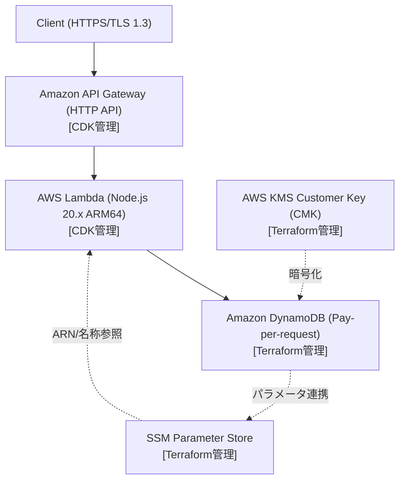

# Serverless Dual Engine IaC ⚡

> **Terraform × AWS CDK「二刀流」で切り拓く、完全サーバーレスRESTful API基盤**

堅牢性を極めるステートフル層（DynamoDB, KMS）は **Terraform** で宣言的に保護し、俊敏性を求められるアプリケーション層（API Gateway, Lambda）は **AWS CDK (TypeScript)** で爆速デプロイする。
二つのIaCツールの強みをSSM Parameter Storeを介して疎結合に調和させた、次世代のサーバーレス・アーキテクチャテンプレートです。

---

## 🌟 ハイライト

- **静と動の責務分離**: 破壊リスクを極小化したい永続データ層はTerraform、アプリと密結合する配信層はCDKで型安全に構築。
- **完全サーバーレス & ゼロ運用**: API Gateway (HTTP API) + ARM64 Lambda (Node.js 20) + DynamoDB (オンデマンド) で低レイテンシー・高コストパフォーマンスを実現。
- **エンタープライズ品質の保護**: KMS CMK 暗号化、DynamoDB PITR (ポイントインタイムリカバリ)、削除保護 (`deletion_protection`) を標準配備。
- **パラメータドリブンな連携**: Terraformが出力したリソースARN/テーブル名をAWS SSM Parameter Storeに集約し、CDKから参照することで完全モノレポ疎結合を達成。

---

## 🏗️ システムアーキテクチャ



---

## 📁 ディレクトリ構造

```text
.
├── terraform/                # [Terraform] ステートフル基盤レイヤー
│   ├── main.tf              # Provider, KMS, SSM定義
│   ├── dynamodb.tf          # テーブル定義・暗号化・PITR設定
│   ├── iam.tf               # ベースIAMポリシー
│   ├── outputs.tf           # CDK連携用SSMパラメータ出力
│   └── terraform.tfvars
│
└── cdk/                      # [AWS CDK] アプリケーション・配信レイヤー
    ├── bin/
    │   └── app.ts           # CDKエントリーポイント
    ├── lib/
    │   └── api-stack.ts     # API Gateway + Lambda スタック (SSM Lookup)
    ├── src/
    │   └── handlers/        # Lambdaファンクション実装コード
    ├── cdk.json
    └── package.json
```

---

## 🚀 展開手順（Lifecycle）

本リポジトリは、2フェーズに分けたデプロイ順序を推奨しています。

### Phase 1: Terraform（基盤・ステートフル層の適用）

```bash
cd terraform
terraform init
terraform plan
terraform apply
```
*※ DynamoDBテーブルおよびKMSキーが作成され、SSM Parameter Storeに設定値が登録されます。*

### Phase 2: AWS CDK（アプリ・API層の適用）

```bash
cd ../cdk
npm install
npx cdk synth
npx cdk deploy
```
*※ SSM Parameter Store経由でテーブル情報を取得し、API GatewayとLambdaが即座に起動します。*

---

## 🎬 キャスト & エンドロール

本プロジェクトは『AIアプリ工場劇場』の精鋭エージェントたちによって自律共創されました。

- **要件策定 & システム青写真**: agent🔵
- **アーキテクチャレビュー & 二刀流戦略**: agent🍇
- **インフラコード実装 (Terraform & CDK)**: agent🍊
- **品質検証・セキュリティ監査 & テスト**: agent🟢
- **プロデュース & 統合**: agent🟡
